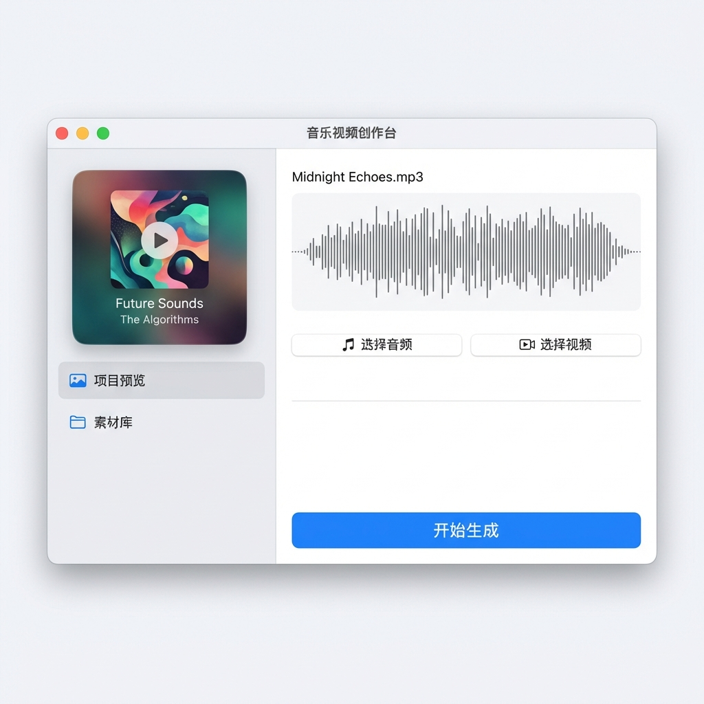
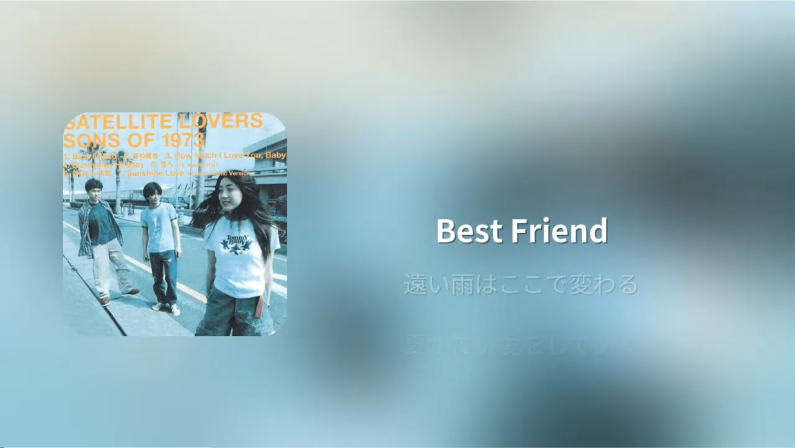

<div align="center">

# 🎵 Auto-Lyric-Video-Generator

**自动化歌词视频生成器 | Automated Lyric Video Creator**

[](LICENSE)
[](https://www.python.org/)
[]()
[](https://www.riverbankcomputing.com/software/pyqt/)

*一键将音频、LRC 歌词与封面合成为精美的动态歌词视频*

</div>

---

## ✨ 功能特性

| 功能 | 描述 |
|:---:|:---|
| 🎤 **LRC 精准同步** | 精确解析 `.lrc` 文件，实现歌词与音乐的完美同步 |
| 🌐 **多语言智能换行** | 内置 jieba 分词，智能处理中文、日文、英文换行 |
| 🎨 **动态背景** | 基于封面自动生成模糊呼吸感背景动画 |
| 💿 **圆角封面** | 自动处理专辑封面为精致圆角效果 |
| 📊 **波形预览** | GUI 界面集成音频波形可视化 |
| 📁 **批量处理** | 支持文件夹批量识别并队列生成 |

---

## 📸 界面预览

<div align="center">
  
  <p><em>简洁优雅的 Apple 风格用户界面</em></p>
</div>

---

## 🚀 快速开始

### 📥 1. 克隆项目

```bash
git clone https://github.com/Ringo-zyc/Auto-Lyric-Video-Generator.git
cd Auto-Lyric-Video-Generator
```

### 📦 2. 安装依赖

> **前置要求**：Python 3.7+ 和 [FFmpeg](https://ffmpeg.org/download.html)（需添加到系统 PATH）

```bash
pip install moviepy numpy Pillow pylrc PyQt5 jieba
```

### ▶️ 3. 启动程序

```bash
python music_video_app.py
```

---

## 📁 项目结构

```
Auto-Lyric-Video-Generator/
├── 📱 music_video_app.py    # PyQt5 GUI 主程序
├── 🎬 video_generator.py    # 核心视频生成引擎
├── 📝 make_lyric_video.py   # 命令行版本（独立使用）
├── 🔤 Fonts/                # 字体文件 (Noto Sans SC/JP)
├── 🎵 Songs/                # 输入文件示例目录
├── 📤 Output/               # 视频输出目录
└── 🖼️ assets/               # README 资源文件
```

---

## 📝 使用说明

### 准备资源文件

| 文件类型 | 命名要求 | 说明 |
|:-------:|:-------:|:-----|
| 🎵 音频 | `song.mp3` | 支持 MP3 格式 |
| 📄 歌词 | `song.lrc` | 与音频同名的 LRC 文件 |
| 🖼️ 封面 | `cover.png/jpg` | 建议 1:1 正方形比例 |

### 两种工作模式

- **单曲模式**：手动选择音频、歌词和封面文件
- **批量模式**：选择包含多个歌曲文件夹的根目录，程序自动匹配并批量生成

---

## 👀 效果预览

<div align="center">
  <a href="https://www.bilibili.com/video/BV1XzTkz3Eo3/">
    
  </a>
  <p><em>👆 点击图片观看 Bilibili 演示视频</em></p>
</div>

---

## 🤝 贡献

欢迎提交 [Issue](https://github.com/Ringo-zyc/Auto-Lyric-Video-Generator/issues) 和 [Pull Request](https://github.com/Ringo-zyc/Auto-Lyric-Video-Generator/pulls)！

## 📄 开源协议

本项目采用 [MIT License](LICENSE) 开源协议。

---

<div align="center">
  <sub>Made with ❤️ by <a href="https://github.com/Ringo-zyc">Ringo-zyc</a></sub>
</div>
